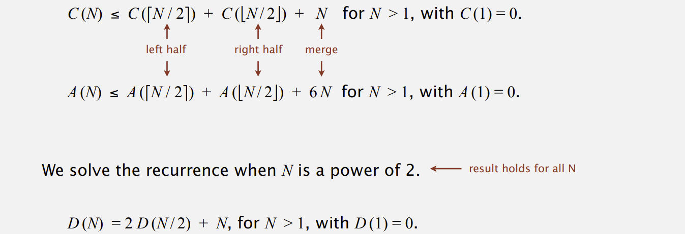
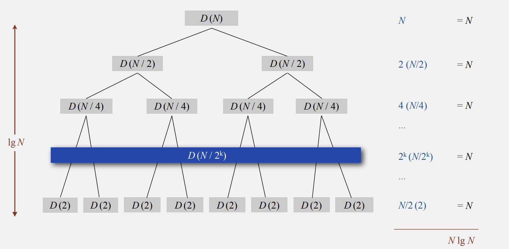
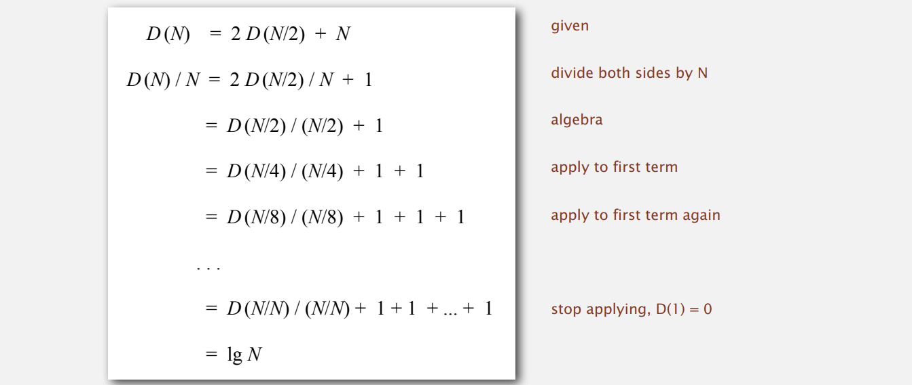
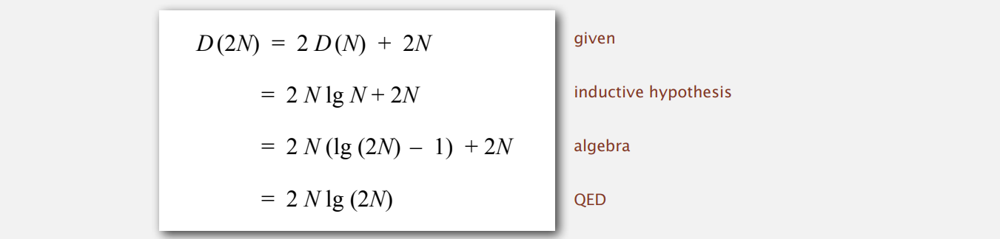
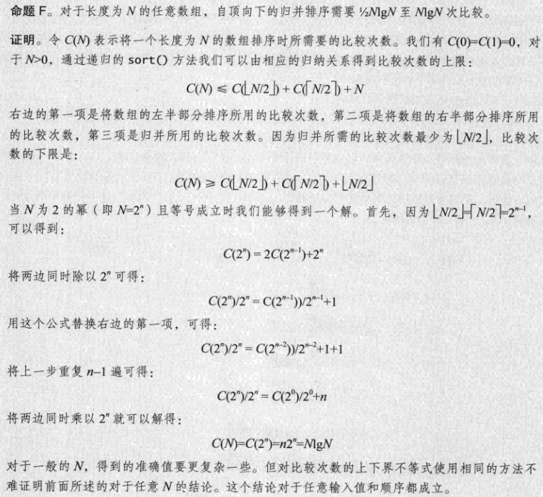
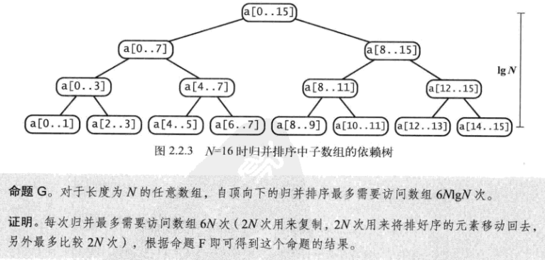
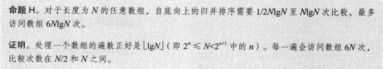
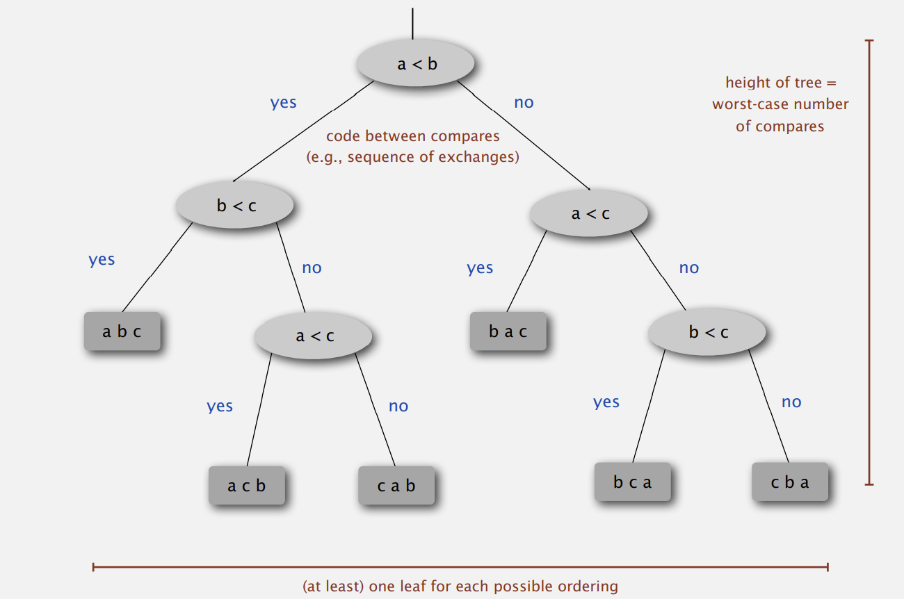
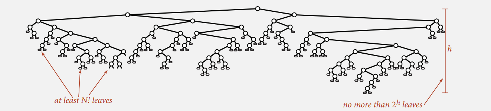

# Merge Sort

## ‣ Inplace & Up-bottom Merge Sort

```java
private static void merge(Comparable[] a, Comparable[] aux, int lo, int mid, int hi) {
    // precondition: a[lo .. mid] and a[mid+1 .. hi] are sorted subarrays
    assert isSorted(a, lo, mid);
    assert isSorted(a, mid+1, hi);

    // copy to aux[]
    for (int k = lo; k <= hi; k++) {
        aux[k] = a[k];
    }

    // merge back to a[]
    int i = lo, j = mid+1;
    for (int k = lo; k <= hi; k++) {
        if      (i > mid)              a[k] = aux[j++];
        else if (j > hi)               a[k] = aux[i++];
        else if (less(aux[j], aux[i])) a[k] = aux[j++];
        else                           a[k] = aux[i++];
    }

    // postcondition: a[lo .. hi] is sorted
    assert isSorted(a, lo, hi);
}


// mergesort a[lo..hi] using auxiliary array aux[lo..hi]
private static void sort(Comparable[] a, Comparable[] aux, int lo, int hi) {
    if (hi <= lo) return;
    int mid = lo + (hi - lo) / 2;
    sort(a, aux, lo, mid);
    sort(a, aux, mid + 1, hi);
    merge(a, aux, lo, mid, hi);
}

/**
     * Rearranges the array in ascending order, using the natural order.
     * @param a the array to be sorted
     */
public static void sort(Comparable[] a) {
    Comparable[] aux = new Comparable[a.length];
    sort(a, aux, 0, a.length-1);
    assert isSorted(a);
}
```

#### Number of Compares and Array Access

**Proposition.**: Merge sort uses at most N lg N compares and 6 NlgN array accesses to sort any array of size N

**Pf sketch.** The number of compares C(N) and array accesses A (N) to merge sort an array of size N satisfy the recurrences:



#### Divide-and-conquer recurrence: proof by picture

**Proposition1.** If D (N) satisfies D (N) = 2 D (N / 2) + N for N > 1, with D (1) = 0, then D (N) = N lg N

**Pf1.** [assuming N is a power of 2]



**Proposition2.** If D (N) satisfies D (N) = 2 D (N / 2) + N for N > 1, with D (1) = 0, then D (N) = N lg N.

**Pf 2.** [assuming N is a power of 2]



**Proposition3.** If D (N) satisfies D (N) = 2 D (N / 2) + N for N > 1, with D (1) = 0, then D (N) = N lg N. 

**Pf 3.** [assuming N is a power of 2] 

- Base case: N = 1. 

- Inductive hypothesis: D (N) = N lg N. 
- Goal: show that D (2N) = (2N) lg (2N).



#### Merge sort analysis: memory

**Proposition.** Mergesort uses extra space proportional to N. 

**Pf.** The array aux[] needs to be of size N for the last merge

**Def.** A sorting algorithm is in-place if it uses **≤ c log N** extra memory. 

**Ex.** Insertion sort, selection sort, shellsort.

Challenge for the bored. **In-place merge**. [Kronrod, 1969]

#### Mergesort: practical improvements

Use insertion sort for small subarrays. 

- Mergesort has too much overhead for tiny subarrays. 

- Cutoff to insertion sort for ≈ 7 items.

```java
private static void sort(Comparable[] src, Comparable[] dst, int lo, int hi) {
    // if (hi <= lo) return;
    if (hi <= lo + CUTOFF) {
        insertionSort(dst, lo, hi);
        return;
    }
    int mid = lo + (hi - lo) / 2;
    sort(dst, src, lo, mid);
    sort(dst, src, mid+1, hi);

    // if (!less(src[mid+1], src[mid])) {
    //    for (int i = lo; i <= hi; i++) dst[i] = src[i];
    //    return;
    // }

    // using System.arraycopy() is a bit faster than the above loop
    if (!less(src[mid+1], src[mid])) {
        System.arraycopy(src, lo, dst, lo, hi - lo + 1);
        return;
    }

    merge(src, dst, lo, mid, hi);
}
```

**Stop if already sorted.** （2.2.8）

- Is biggest item in first half ≤ smallest item in second half? 
- Helps for partially-ordered arrays

```java
private static void sort(Comparable[] a, Comparable[] aux, int lo, int hi)
{
    if (hi <= lo) return;
    int mid = lo + (hi - lo) / 2;
    sort (a, aux, lo, mid);
    sort (a, aux, mid+1, hi);
    if (!less(a[mid+1], a[mid])) return;
    merge(a, aux, lo, mid, hi);
}
```

**Eliminate the copy to the auxiliary array.** Save time (but not space) by switching the role of the input and auxiliary array in each recursive call.（2.2.11）

```java
private static void merge(Comparable[] a, Comparable[] aux, int lo, int mid, int hi)
{
    int i = lo, j = mid+1;
    for (int k = lo; k <= hi; k++) 
    {
        if (i > mid) aux[k] = a[j++];
        else if (j > hi) aux[k] = a[i++];
        else if (less(a[j], a[i])) aux[k] = a[j++];
        else aux[k] = a[i++];
    }
}
private static void sort(Comparable[] a, Comparable[] aux, int lo, int hi)
{
    if (hi <= lo) return;
    int mid = lo + (hi - lo) / 2;
    sort (aux, a, lo, mid);
    sort (aux, a, mid+1, hi);
    merge(a, aux, lo, mid, hi);
}
```





可以用归并排序处理数百万甚至更大规模的数组，主要缺点是辅助数组使用的额外空间和 N 的大小成正比。且还可以通过其他思考来大幅缩短归并所需实践

## ‣ Bottom-up Merge Sort



当数组长度为 2 的幂时，两种归并所用的 Compare 和 Array Access 正好相同，只是顺序不同，其他情况，会有不同（见 2.2.5）

button-up 适合用链表组织的数据，只需要重新组织链表链接就可以原地排序（无需创建任何新的链表结点）

都可以尝试，是希望用 Merge.sort() 化整为零地递归解决，还是 MergeBU.sort() 循序渐进地解决问题

## ‣ Sorting Complexity 

#### Complexity of sorting

Computational complexity. —— Framework to study efficiency of algorithms for solving a particular problem X. 

Model of computation. —— Allowable operations. 

Cost model. —— Operation count(s). 

Upper bound. —— Cost guarantee provided by some algorithm for X. 

Lower bound. —— Proven limit on cost guarantee of all algorithms for X. 

Optimal algorithm. —— Algorithm with best possible cost guarantee for X.

#### Decision tree (for 3 distinct items a, b, and c)



#### Compare-based lower bound for sorting

**Proposition.** Any compare-based sorting algorithm must use at least lg ( N ! ) ~ N lg N compares in the worst-case. 

**Pf.** 

- Assume array consists of N distinct values a1 through aN. 
- Worst case dictated by height h of decision tree. 
- Binary tree of height h has at most 2 h leaves. 
- N ! different orderings ⇒ at least N ! leaves



**Proposition.** Any compare-based sorting algorithm must use at least lg ( N ! ) ~ N lg N compares in the worst-case. 

**Pf.** 

- Assume array consists of N distinct values a1 through aN.
- Worst case dictated by height h of decision tree.
- Binary tree of height h has at most 2^h leaves.
- N! different orderings ⇒ at least N! leaves.


## ‣ Comparators

## ‣ Stability
